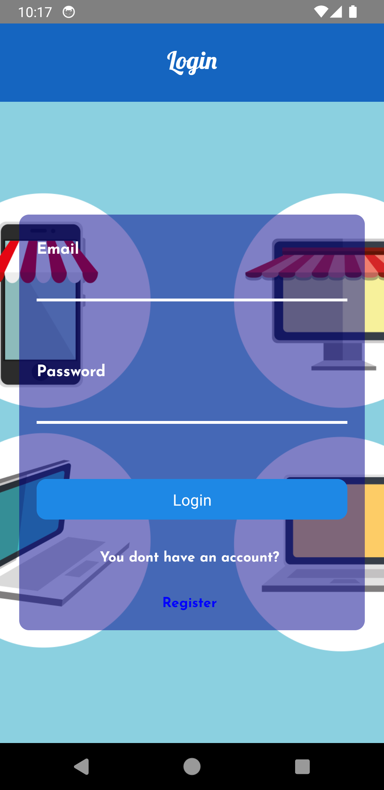
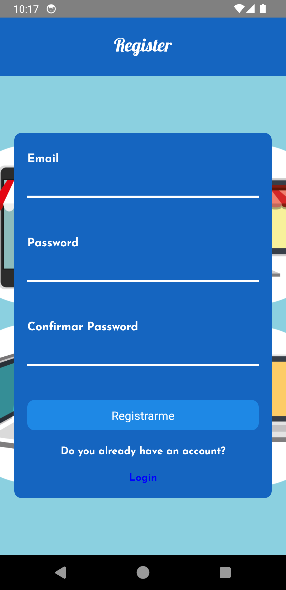
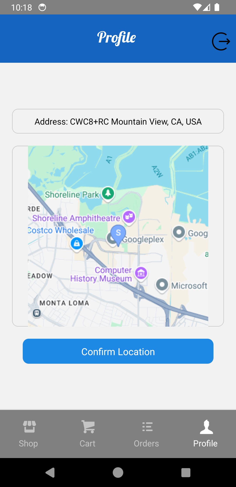
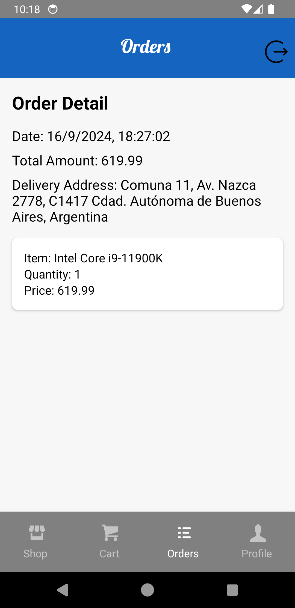

# E-Commerce App - React Native
An e-commerce application developed with React Native that offers a complete and user-friendly shopping experience.
## Main Features

### Login Screen
  

### Register Screen
  

### Account Screen

- **Secure Access:** Only authenticated users can access the profile screen and make purchases.
- **User Information:** Displays user details such as name and address and let the user select an address where to ship 
- products.

    
  

### Authentication with Firebase
- Utilizes Firebase authentication system to manage user access.
- Allows users to log in and register securely.

### Categories Screen
- Displays a selection of categories in cards.
- Clicking on a category navigates to the corresponding product screen.

### Products Screen
- Lists all products in cards with name and photo.
- Includes a search bar to filter products by name.
- Clicking on a product navigates to the product details screen.

### Product Details Screen
- Provides a detailed description of the product.
- Displays price and available stock.
- Allows adding the product to the cart.
- Allows to modify the amount of products you want to add

  

### Orders screen
-List of orders. 

### Orders Details
- Show the details of the order. Including total ,date, address to be delivered,
  amount, products and quantity of each product.

  

## Technologies Used
- **Firebase Authentication:** Implements Firebase authentication system to manage app security.
- **React Native Navigation Stack:** Manages navigation between screens.
- **React Native Navigation Bottom Tab:** Manages navigation between tabs.
- **Expo-Location:** Provides access and management of user location.
- **Expo-Image-Picker:** Facilitates profile image upload.
- **Redux:** Centralizes and manages the application state.
- **RTK Query and Firebase:** Performs read/write operations in the database.

## Installation
1. Clone the repository: `git clone https://github.com/sevax88/coderhouseTpFinalRn.git`
2. Install dependencies: `npm install`
3. Configure API keys for external services (Expo-Location, Firebase, etc.).
4. Set up Firebase credentials in your project.
5. Run the application: `npm start`

