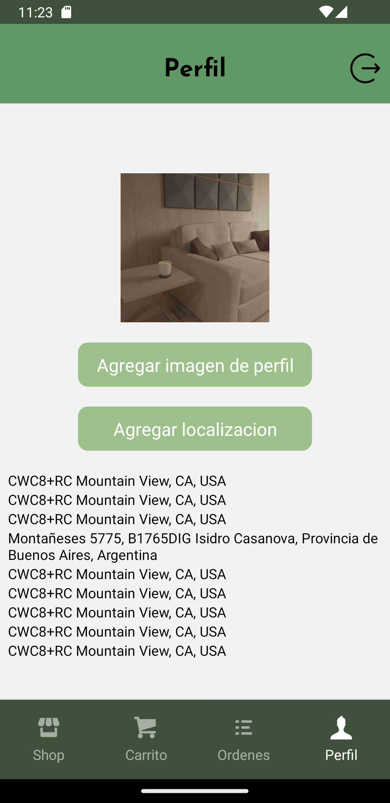

# E-Commerce App - React Native
An e-commerce application developed with React Native that offers a complete and user-friendly shopping experience.
## Main Features
### Account Screen

- **Secure Access:** Only authenticated users can access the profile screen and make purchases.
- **User Information:** Displays user details such as name and address.
  
  

### Authentication with Firebase
- Utilizes Firebase authentication system to manage user access.
- Allows users to log in and register securely.

### Categories Screen
- Displays a selection of categories in cards.
- Clicking on a category navigates to the corresponding product screen.

### Products Screen
- Lists all products in cards with name and photo.
- Includes a search bar to filter products by name.
- Clicking on a product navigates to the product details screen.

### Product Details Screen
- Provides a detailed description of the product.
- Displays price and available stock.
- Allows adding the product to the cart.
  
  
  


### Bottom Navigation
```javascript
   const TabNavigator = () => {
  return (
        <Tab.Navigator
          screenOptions={{
            headerShown: false,
            tabBarShowLabel: false,
            tabBarStyle: styles.tabBar
          }}
        >
          <Tab.Screen
             name="ShopStack"
             component={ShopStack}
             options={{
              tabBarIcon: ({focused}) => <TabIcon icon="shop" label="Products" focused={focused}/>
             }}
          />
          <Tab.Screen 
              name="CartStack" 
              component={CartStack}
              options={{
                tabBarIcon: ({focused}) => <TabIcon icon="shopping-cart" label="Cart" focused={focused}/> 
              }}
             />
             <Tab.Screen 
              name="OrdersStack" 
              component={OrdersStack}
              options={{
                tabBarIcon: ({focused}) => <TabIcon icon="list" label="Orders" focused={focused}/> 
              }}
             />
            <Tab.Screen 
              name="ProfileStack" 
              component={ProfileStack}
              options={{
                tabBarIcon: ({focused}) => <TabIcon icon="user" label="Profile" focused={focused}/> 
              }}
             />
      </Tab.Navigator>
```
- **Tab 1 - Products:** Categories and products (main stack).
- **Tab 2 - Cart:** Shopping cart details with summary and checkout button.
- **Tab 3 - Orders:** History of completed orders.
- **Tab 4 - Profile:** User information, location, and profile image upload.

## Technologies Used
- **Firebase Authentication:** Implements Firebase authentication system to manage app security.
- **React Native Navigation Stack:** Manages navigation between screens.
- **React Native Navigation Bottom Tab:** Manages navigation between tabs.
- **Expo-Location:** Provides access and management of user location.
- **Expo-Image-Picker:** Facilitates profile image upload.
- **Redux:** Centralizes and manages the application state.
- **RTK Query and Firebase:** Performs read/write operations in the database.
- 
## Installation
1. Clone the repository: `git clone https://github.com/your-username/your-app.git`
2. Install dependencies: `npm install`
3. Configure API keys for external services (Expo-Location, Firebase, etc.).
4. Set up Firebase credentials in your project.
5. Run the application: `npm start`

## Contact


